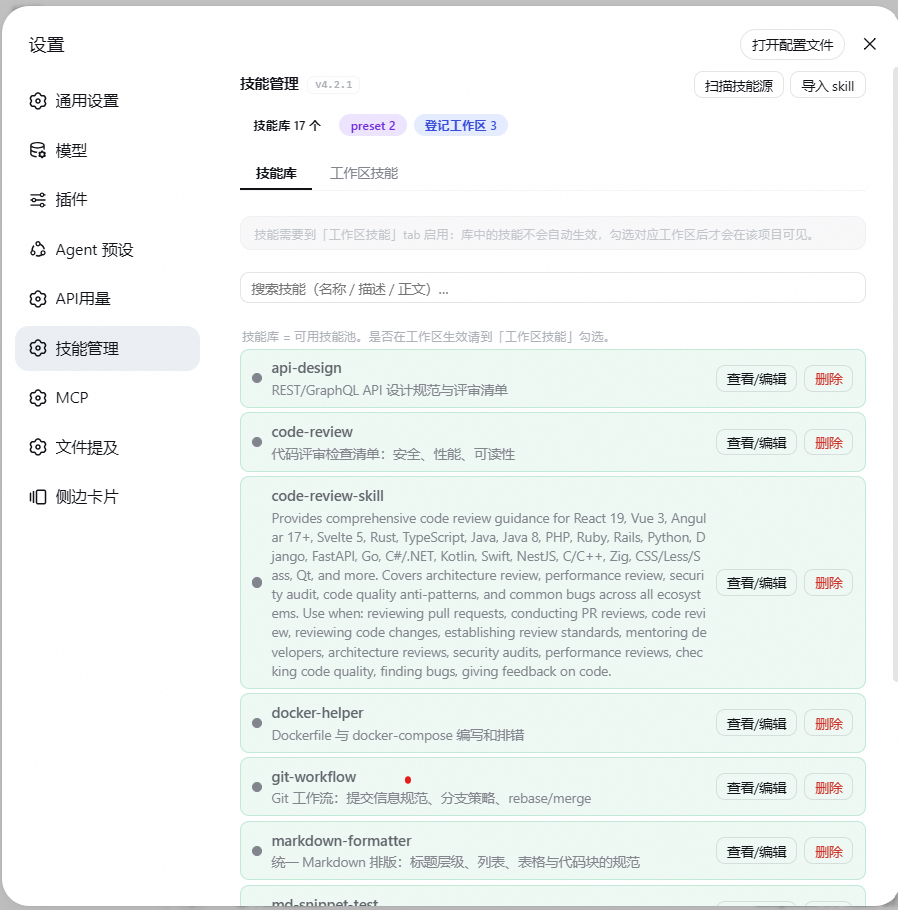
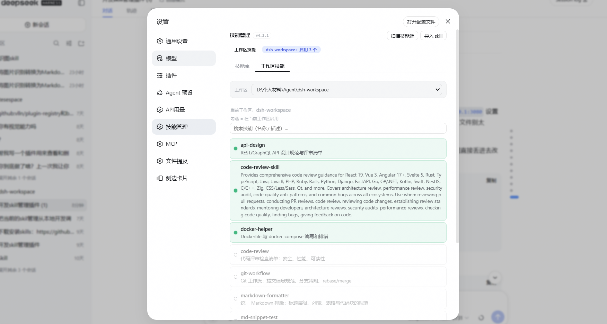
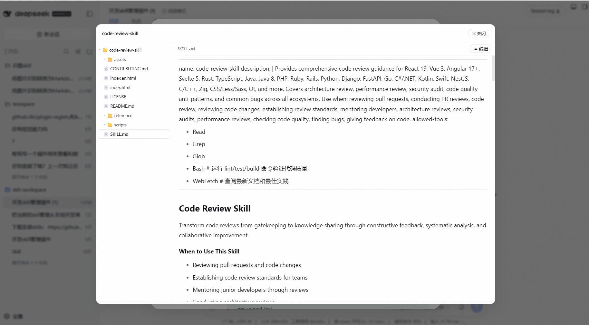
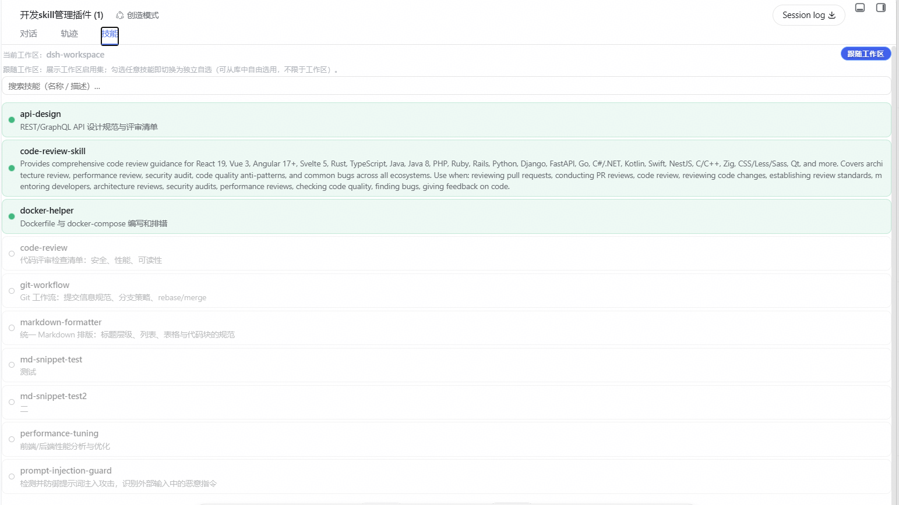

# dsh-skill-manager

一个 DeepSeek Harness（DSH）插件：为 DSH 代理的**技能**提供完整的管理平面——统一查看、编辑、导入、管理，并按照「技能库 / 工作区 / 会话」三层模型精细控制每个技能在何时何地生效。**技能库只存技能，启用跟着项目走**：技能放进库中不会自动生效，只有某个工作区勾选启用后，该工作区（及其会话）才看得到它。

## 界面预览

**设置面板 · 三层模型**



**工作区启用白名单**



**技能文件浏览/编辑**



**会话级勾选**



DSH 的「技能」是带 YAML frontmatter 的 Markdown 文件，是代理可复用的能力包。技能一多就会散落，难以统一管理。dsh-skill-manager 把这一切收拢成一个管理平面：

- **技能库** — 列出/查看/编辑/导入/删除全部技能（目录形式：文件夹 + SKILL.md）。库只是可用技能池，不负责启用。
- **工作区技能** — 每个项目独立维护自己的技能集合（跟随项目目录走），**唯一的启用开关**：勾选=该项目启用，未勾选=该项目完全不可见。
- **会话技能** — 针对当前会话临时勾选，默认跟随工作区，可固定自选（**库全集自由勾选**，不限于工作区启用集）。
- **跨层搜索** — 名称 / 描述 / 使用场景 / 正文全文匹配，带命中标注。
- **统一界面** — 设置页双标签页 + 会话页技能面板，三处共用同一套行组件（整行点击切换、启用高亮、停用置灰+描边、预设只读、自动分页）。
- **跨插件集成** — 宿主侧提供 `skillManager` 服务门面，其他 Cordis 插件 `inject: ['skillManager']` 即可调用全部能力。

它不改变 DSH 的技能加载机制——它管理技能在磁盘上的组织方式，让 DSH 原生引擎读到的正是你想要的集合。

> **v2.0 里程碑（dsh 0.2 世代首发，取代 4.x 编号线）**：编号约定改为「插件大版本 = 它服务的 dsh 代际」——`2.x` 服务 dsh `0.2.x`，`1.x` 服务 dsh `0.1.x`（`1.3.5` = 旧 `4.3.5` 的同内容重编号），旧 `4.x` 已弃用。代码侧适配 dsh 0.2 的三处非兼容变更：① **预设层改走作用域 API** —— `agentPresets.resolvedRoots` 与磁盘预设目录在 0.2 均已消失，改为 `agentPresets.acquireScope(id)` + `ctx.skills.list({ scope })` 读取每个预设自己的技能层，并扣掉「环境目录 + 多预设共有」的部分，只保留该 preset 真正新增的贡献（租约在 finally 释放）；② **webServer 改为晚挂载懒注册** —— 0.2 里 `dsh-host-webserver` 在插件行 apply 之后才挂载，旧的 `apply` 期读一次 `ctx.webServer` 会静默不注册路由，现在走 `ctx.inject(['webServer'], cb)` 且注册成功会留一行 info 日志；③ **补齐世代声明** —— 新增 `@deepseek-ai/dsh-*` 的 `peerDependencies`（`>=0.2.0-rc.2 <0.3.0`），并新增清单级护栏 `test/manifest-compat.test.mjs`（17 项）拦住这些**静默失败**；④ 另修两处同源静默缺陷 —— 路由析构改用 `ctx.effect`（0.2 没有 `dispose` 事件，旧写法让 disposer 永不执行，重载时 `duplicate route` 会直接炸掉插件）、客户端"当前会话"改用官方口径推导（0.2 的会话快照没有 `current` 字段，旧读法让面板恒无当前工作区）；⑤ 修掉会话层一处写死缺陷 —— `/view` 回传的是「已保存的 cwd」而不是**生效的工作区**，未写过插件状态的会话因此拿到空 cwd，会话页的逐个勾选与「回到跟随工作区」全部以 `cwd 必须为工作区绝对路径` 失败（表现就是"点了完全没反应"）；现在服务端改用会话的**持久化 header**（`sessionPersistence.stat`，不取写所有权、与内存状态无关）解析工作区——`ctx.sessions` 是**按进程独立**的内存存储，而"只是打开一个会话"并不会把它放进去，所以旧写法在 test/desktop 任一实例里都会把这个会话解析成空工作区；同时客户端不再上传空 cwd，勾选里出现技能库之外的名字时会**明确列出**而不是静默丢弃。详见 [docs/VERSIONING.md](docs/VERSIONING.md) 与 [docs/RELEASE.md](docs/RELEASE.md)。
>
> **v4.3 里程碑**：浏览器信任围栏——面板 API（`/skill-manager/api/*`）接入与 dsh 官方 `/api` 一致的 confused-deputy 防线（`isTrustedPanelRequest`）：Host 必须为 loopback（localhost / 127/8 / [::1]，防 DNS rebinding）、`sec-fetch-site: cross-site` 一律 403（防 CSRF）、带 Origin 时须同源；测试 203 条。此围栏镜像 `dsh-client-connection` 的 `isTrustedApiRequest`（官方 RPC 通道内置，插件自建路由需自行复制），纯头判定、无额外依赖。
>
> **v4.2 里程碑**：引擎视角校验——`/view` 经原生 `ctx.skills.list({ cwd })` 查询引擎实际加载的技能集，工作区/会话面板对「工作区白名单已启用但引擎未加载（missing）」「同名被其他来源覆盖（shadowed）」的技能标红色角标（悬停显示原因）；配套 host 纯函数 `engineLoadState`/`collectEngineLoaded`；测试 190 条。原生 skills 接口仅作只读校验，磁盘白名单主链路保持不变。
>
> **v4.2.1 语义修正**（跟随审核修复）：① 引擎查询返回**空列表**一律按 `unknown` 处理（不亮角标）——宿主侧 `list()` 可能看不到挂在 scope 层的 provider，引擎实际仍加载着技能，空 ≠ 未加载，宁无声不误报；② `missing`/`shadowed` 只对**工作区白名单启用**（引擎契约该加载的磁盘事实）判定，纯会话勾选（视图层，v4.1 语义）不再被标「未加载」。
>
> **v4.1 里程碑**：会话层放开为库全集自由勾选（「回到跟随」一键恢复，隐式回跟随移除）；技能详情模态收束为单一文件浏览（Markdown 渲染预览、根目录节点、左右 15%/高度 30–80% 可拖）；工作区列表自动补齐会话存储（含未打开面板的工作区）、死路径读即清、面板显示插件版本角标。
>
> **v4.0 里程碑**：彻底移除单文件兼容（统一目录形式）、安全加固（路径穿越/zip 炸弹/越权 cwd 全防线）、平台兼容（Windows / Linux / macOS 均可部署）、前端体积预检、宿主服务门面、错误边界测试（165 条）。

## 安装

**先选世代**：插件大版本 = 它服务的 dsh 代际。

| 你的 dsh | 装哪个 | 命令 |
|---|---|---|
| `0.2.x`（当前，桌面版 DeepSeek Harness） | **2.x** | `dsh plugin --profile web add @yanglaofish/dsh-skill-manager@^2.0.1` |
| `0.1.x`（旧内核） | `1.x` | `dsh plugin --profile web add @yanglaofish/dsh-skill-manager@^1.0.0` |

> 从旧编号升级：历史 `4.x` 线已弃用（`npm deprecate`），它的最后版本是 `4.3.5`，等价于 `1.3.5`。
> 由 `4.x` 换到 `2.x` 需要**显式改范围**——`^4.3.5` 不会自动升到 `2.0.1`（semver 上 2.0.1 更小），
> 这正是"代际对齐"的代价，也是我们刻意接受的：版本号能直接读出可装的内核。

两种安装方式任选其一（npm 包已发布，拉取即用、免构建授权）：

**方式 A：npm 安装（推荐）**

```sh
dsh plugin --profile web add @yanglaofish/dsh-skill-manager@^2.0.1
```

**方式 B：GitHub 源安装**

```sh
dsh plugin --profile web add github:yanglaofish/dsh-skill-manager
```

安装完成后直接启动：

```sh
dsh web
```

## 使用

**推荐：页面管理** —— 启动 `dsh web` 后，进入设置 → 技能管理：

实际使用同目录形式技能：**全局技能**标签页：「查看/编辑」打开详情模态（**直接进入文件浏览**，默认选中 SKILL.md 技能文档，可点「✏ 编辑」改内容、顶部 ftbar 保存/取消，保存上限 2MB）；「导入 skill」支持技能压缩包（≤50MB，解压 ≤100MB）或整个文件夹批量导入。
- **工作区技能**标签页：顶部下拉选择工作区（自动定位当前会话的工作区），下方列出该工作区启用的技能（未启用行灰描边）；preset 技能只读并标注所属预设。
- **搜索框**：输入关键词即跨全部层级全文检索（名称/描述/whenToUse/正文），结果标注命中字段与上下文片段。
- **会话页「技能」tab**：查看并临时调整当前会话启用的技能子集。

**备选：对话管理** —— 直接对 agent 说：

- 「列出我有哪些技能」
- 「把 markdown-formatter 在工作区启用」
- 「导入这个技能压缩包」
- 「搜索包含 SQL 优化的技能」

agent 会调用 `skill_manager_*` 工具（共 13 个）完成操作。其他插件则可通过 `inject: ['skillManager']` 直接调用宿主服务门面（list/get/edit/delete/importZip/workspaceToggle/sessionSet 等 17 个方法）。

## 卸载

```sh
dsh plugin --profile web remove @yanglaofish/dsh-skill-manager
```

## 技术方案

### 整体架构

插件由「宿主侧」（Node，随 DSH 主进程运行）与「客户端侧」（浏览器 bundle，随 Web UI 运行）两部分组成，通过 `/skill-manager/api/*` 自注册 HTTP 接口衔接。宿主侧为原生 ESM（无编译步骤），客户端侧为手写 `react.createElement` 的原生 JS bundle。

```
dsh-skill-manager
├── lib/
│   ├── index.js               宿主侧（原生 ESM，无需编译）
│   │   ├── 模块级函数         扫描/解析/CRUD/导入/搜索/工作区/会话/预设/
│   │   │                      安全门禁（isValidIdentifier/isAbsolutePath/
│   │   │                      samePath/assertRegisteredWorkspace）
│   │   └── apply()            装配 13 个 skill_manager_* 工具 + HTTP 路由
│   │                          （webServer 晚挂载，走 ctx.inject 懒注册）
│   │                          + skillManager 宿主服务门面 + sessions/
│   │                          agentPresets 注入解析 + 预设层作用域读取
│   └── client.js              客户端 bundle（__ModuleLoader__ 包装）
│       ├── SkillManagerPanel    设置页：统计条 + 双 tab + 搜索 + 分页 + 详情模态
│       ├── WorkspaceSkillsPanel 工作区/会话技能面板
│       ├── SkillDetailModal      详情模态：文件浏览（默认 SKILL.md）+ 编辑
│       └── SkillRow             三处共用的统一技能行组件
├── cordis.patch.yml          bundle patch：挂载宿主侧插件行
├── test/
│   ├── unit.mjs              219 条隔离单测（临时 DSH_HOME，含错误边界）
│   ├── manifest-compat.test.mjs  世代护栏：peer 范围 / 客户端 inject / 晚挂载 webServer / 预设作用域
│   └── seed-sample.mjs       示例技能写入工具（开发验证用）
├── docs/
│   ├── VERSIONING.md         版本约定：插件大版本 = 它服务的 dsh 代际
│   └── RELEASE.md            发布手册：test profile → tag → CI → 淘宝强制同步 → web → desktop
├── README.md / README-en.md
└── package.json              bundle 清单：exports + dsh.client + dsh peer 世代声明
```

**核心设计原则**：技能的状态只有单一事实源 —— 磁盘上的目录结构。技能存放在技能库（`~/.dsh/skill-manager/library/`，引擎不扫描），工作区启用是 `<项目根>/.dsh/skills` 里的白名单（引擎唯一可见源），会话勾选在独立 JSON；所有界面与工具都读取同一份磁盘事实，不存在内存态与磁盘态的分叉。项目根与 dsh 引擎一致 —— 从会话 cwd 向上找最近的 `.git` 所在目录（`dsh-skill-filesystem.findProjectRoot`），找不到就回落为 cwd：子目录工作区的启用会正确落在仓库根，旧版建在 `<cwd>/.dsh/skills` 的链接会自动合并迁移过去。

### 三层模型

```
┌─ 会话层  (Session)     ~/.dsh/skill-manager/sessions/<sessionId>.json
│    默认跟随工作区；可用库中任意技能固定自选
├─ 工作区层 (Workspace)  <项目根>/.dsh/skills/  ← 引擎唯一扫描的工作区根
│    symlink/copy → 技能库文件；存在 == 该工作区启用
└─ 技能库   (Library)    ~/.dsh/skill-manager/library/  ← 纯技能池，引擎不扫
                         所有用户技能平铺于此；不做启用/停用
```

**关键语义**：技能库不是「全局启用」——库中的技能对任何工作区都不可见，直到某个工作区把它勾选进 `<项目根>/.dsh/skills`（白名单）。这避免了旧模型「全局启用了但项目不想开」的冲突：启用与否完全由每个项目自己决定。技能库位于 `~/.dsh/skill-manager/` 下，不在任何被扫描的磁盘根里（dsh 0.2 的 `dsh-skill-filesystem` 只扫项目根 `.dsh/skills` / `.agents/skills`、`customSkillDirs` 与用户根），天然实现白名单。第三层「预设」由 dsh 引擎自己贡献，见下。

**预设层在 dsh 0.2 的口径**：预设不再是磁盘目录，而是 `@deepseek-ai/dsh-agent-preset` 加载器行——它把自己的 `plugins`（其中可能挂载 `dsh-skill-filesystem` + `customSkillDirs`）挂进该预设**自己的作用域**。因此本插件这样做：

1. `agentPresets.list()` 拿到预设清单（live 的 `name`/`order` 优先，`standard` / `ptc` / `minimal` / `cordis` 的 id 表只作兜底）；
2. 对每个预设 `acquireScope(id)` 取一个 **引用租约**（`dsh-agent-preset-registry` 的 `retain` 只做计数，不是重新挂载；未知/损坏的预设会抛，直接跳过），用它的 `key` 作 `ctx.skills.list({ scope })` 的 `scope`，**用完必须在 finally 里 `Symbol.asyncDispose`** 释放，否则该代际永不回收；
3. 扣掉「宿主层（bundled/runtime 内建注册）」与「出现在 ≥2 个预设里的技能」——项目/用户磁盘技能在每个预设作用域里都能看到，不扣掉就会把同一批用户技能按预设数重复列一遍；
4. 剩下的才是该 preset 真正新增的贡献（例如创造模式经 `customSkillDirs` 挂载的 `cordis-plugin-development` 等捆绑技能），只读展示。

### 关键模块

| 模块 | 职责 |
| --- | --- |
| `parseSkillDoc / serializeSkillDoc` | 技能文档解析/序列化：YAML frontmatter + 正文，剥离 UTF-8 BOM |
| `scanDir / findSkill / searchSkills` | 目录扫描、按名定位、跨层全文搜索（命中字段 + 片段） |
| `importSkillDocs / importSkillZipFromBuffer` | 文件夹批量导入 / zip 包导入，逐项校验、部分失败不中断 |
| `linkGlobalSkillToWorkspace / unlink…` | 工作区启用/停用：目录级 symlink 优先，失败降级整目录复制（fs.cp） |
| `readSessionConfig / setSessionSkills` | 会话勾选读写：显式子集（库全集自由勾选）与跟随工作区 |
| `scanPresetSkills` | 预设层读取：`apply()` 装入 0.2 版本的作用域 provider（`agentPresets.acquireScope` + `ctx.skills.list({scope})` + 扣减宿主/共有技能），未运行 `apply()` 或旧内核时回退到 0.1 的磁盘预设目录扫描 |
| `normalizeParameters / registerTool` | 工具参数规范化为标准 JSON Schema（等价 defineTool） |
| `isValidIdentifier / isAbsolutePath / samePath / assertRegisteredWorkspace` | 安全门禁：标识符白名单、平台无关绝对路径、大小写不敏感路径比较、写操作仅限已登记工作区 |
| `SkillManagerPanel / WorkspaceSkillsPanel / SkillDetailModal / SkillRow` | 设置页与会话页 UI、统一行组件、详情模态、分页与排序 |

### 数据流

**查看列表（/list）**

`scanDir(skillsRoot()) + scanPresetSkills() + listWorkspaces()` 并行收集，合并为「技能库 → preset」的技能数组，连同统计条（技能库总数/preset 数/登记工作区数）一次返回。

**工作区解析（/view）**

Client 从会话 store 取当前 sessionId → `/view?sessionId=` → 宿主经 `ctx.sessions.get(id).header.cwd` 解析工作区（免手填路径），并自动登记该工作区；同一响应带回工作区列表供下拉选择，消除「暂无工作区」竞态。

**工作区启用（/workspace/toggle）**

目录形式技能整目录启用：优先 `symlink(sourceDir, targetDir, 'dir')` 创建目录符号链接（单副本、编辑即时同步；Windows 未开启开发者模式时自动降级）；降级用 `fs.cp` 整目录复制（跨盘可用）。重启用先清理旧目录再重建，幂等。写操作（toggle/文件写入/会话设置）仅允许**已登记工作区**，杜绝越权修改任意磁盘路径。

**会话设置（/session/set）**

Client 勾选技能即固定显式子集（`explicit=true`）：宿主允许库中任意技能入选（工作区启用集只定义「跟随」默认值，不限制显式自选）；点「回到跟随」恢复 `explicit=false`、清空子集，会话回到工作区启用集。

**搜索（/search?q=）**

跨全局（启用+禁用）/ preset / 所有已登记工作区收集，大小写不敏感子串匹配名称/描述/whenToUse/正文；同名去重按「工作区 > 全局 > preset」优先级，返回命中字段 `why` 与正文片段 `snippet`。

### 关键设计细节

- **Windows 跨盘**：`~/.dsh` 在 C 盘、工作区在 D 盘时硬链接必然失败（`EXDEV`）。symlink 需要开发者模式/管理员权限，故设计为**优先目录 symlink、自动降级整目录复制**，两种传输方式对外行为一致。
- **跨平台部署**（v4.0）：绝对路径判断用 `node:path.isAbsolute`（Windows 正/反斜杠、POSIX `/`、UNC 均正确）；路径相等比较 `samePath` 在 Windows 大小写不敏感；客户端路径分隔符归一化。Windows / Linux / macOS 均可运行。
- **安全门禁**（v4.0）：技能名/sessionId 白名单（`isValidIdentifier`）杜绝路径穿越；写操作 cwd 必须是已登记工作区（`assertRegisteredWorkspace`）；HTTP body 2MB、zip 上传 50MB / 条目 1000 / 解压 100MB 上限；错误文案全部中文化，前端上传/保存前即有体积预检。
- **UTF-8 BOM**：Windows 编辑器常给文件加 BOM，破坏严格的 `^---` frontmatter 分隔符导致整段解析失败——`parseSkillDoc` 开头剥离。
- **工具 schema**：裸 `parameters` 映射（`{key: spec}`）在模型投影时被当作 JSON Schema 读取，`type` 为 null 直接报错。`registerTool` 统一规范化为 `{type:'object', properties, required}`（与 `defineTool` 输出等价），13 个工具全部通过校验。
- **宿主服务门面**（v4.0）：`ctx.provide('skillManager', …)` 暴露 17 个方法的编程接口，其他插件 `inject: ['skillManager']` 即用，无需走 HTTP 或模型工具。
- **复用 dsh 渲染器**：Markdown 预览 `require` 种子模块 `@deepseek-ai/dsh-client-ui-primitives` 取用官方 `MarkdownText`（KaTeX 数学 + 代码高亮 + 表格），不内置任何 markdown 库。
- **预设层读取（v2.0 改写）**：dsh 0.1 把 preset 放在磁盘目录里（`agent-presets` 服务的 `resolvedRoots`），bundle 以 junction 安装时基于 `import.meta.dirname` 的相对发现会失效，所以旧版从服务拿权威根。dsh 0.2 两者都没了（`resolvedRoots` 全库 0 命中、不再有 preset 目录，且注册表明确"不扫描目录、不接受 preset 路径"），改为**作用域读取**：`agentPresets.acquireScope(id)` → `ctx.skills.list({ scope })`，用完在 finally 里 `Symbol.asyncDispose` 释放租约。
- **webServer 晚挂载（v2.0）**：`dsh-host-webserver` 在插件行 apply **之后**才挂载，`apply` 期读一次 `ctx.webServer` 会静默不注册路由。改为 `ctx.inject(['webServer'], cb)`（服务已存在则立即执行，后到则稍后执行），并用 `panelApiRegistered` 保证只注册一次。
- **析构必须走 `ctx.effect`（v2.0）**：dsh 0.2 **没有** `dispose` 事件（全库 0 命中，cordis 的卸载通知是内部事件 `internal/plugin`），旧的 `ctx.on('dispose', …)` 永不执行。这不只是泄漏——`webServer.register` 对同一 `(kind, path)` 重复注册会**抛错**，所以插件第一次重载/重启用就会在 `apply` 里炸掉整个插件。现在路由 disposer 注册为 `ctx.effect(() => unregisterRoute, label)`。
- **当前会话推导（v2.0）**：客户端 `sessions.list` 快照在 0.2 是 `{ids, byId, phase, projectionsBySession}`，**没有 `current`**；旧读法让"当前会话"恒为空，面板的工作区下拉总是定位不到。改为官方口径：`byId` 里被主视图 retain 的那一行（`retainedBy.mainView > 0`）。
- **引擎可见性查询要带 scope（v2.0）**：dsh 0.2 把技能目录按 scope 分层，而基础 host `skill-filesystem` 行在本组合里是 `disabled`（本地发现归 preset 所有），因此无 scope 的 `ctx.skills.list({cwd})` **只看得到 runtime/bundled**，"工作区白名单是否真被引擎加载"的角标永远点不亮。改为先解析活体 Agent 的 preset 作用域服务（`agents.get(sessionId)` → `agentPresets.serviceFor(agent, 'skills')`），拿不到再退回全局注册表。
- **无构建步骤**：宿主侧与客户端侧都是纯 JS，客户端 bundle 手写 `react.createElement`，不依赖 JSX/TS/打包器，安装即用。

## 开发

```sh
npm test          # = 下面两步；两者都必须绿
node test/unit.mjs                      # 219 条隔离单测（临时 DSH_HOME，不污染真实环境）
node --test test/manifest-compat.test.mjs   # 17 条运行时世代 / 装配护栏
```

`test/manifest-compat.test.mjs` 拦的是**单测抓不到**的那一类问题——它们全都是"静默失败"：
peer 范围不满足时 dsh 会整包跳过插件、`webServer` 写进顶层 inject 会让插件在无 web 服务的
composition 里永久 pending、`ctx.on('dispose')` 在 0.2 里根本不存在（导致重载时 `duplicate route`
抛错）、`resolvedRoots` 已消失、客户端快照没有 `current` 字段。改 peer / inject / 客户端半边 /
预设层之后，**先跑绿再重启**。

- 所有文件操作均为模块级函数，无需真实运行环境即可单测；`apply()` 只在装配阶段工作。
  `manifest-compat` 用假 ctx 真跑一次 `apply()`：注册路由、重放注入、跑掉 `ctx.effect` 的
  disposer、并调用 `/skill-manager/api/view` 验证会话作用域解析。
- **本地开发模式**（改代码重启即生效）：`test` profile 已用 `link:` 指向本目录，改完重启即可。
- **发布**：`git tag vX.Y.Z && git push origin vX.Y.Z` → GitHub Actions 自动跑测试、发布 npm、
  并主动强制同步淘宝源。完整步骤（含 web / desktop 两个 profile 的更新方式）见
  [docs/RELEASE.md](docs/RELEASE.md)；版本号怎么定见 [docs/VERSIONING.md](docs/VERSIONING.md)。
- **人工发布兜底**：`npm version patch`（或手改）→ `npm publish` → 再补 tag（CI 的发布步骤是幂等的，
  版本已存在会跳过而不是失败）。

## 许可

MIT
